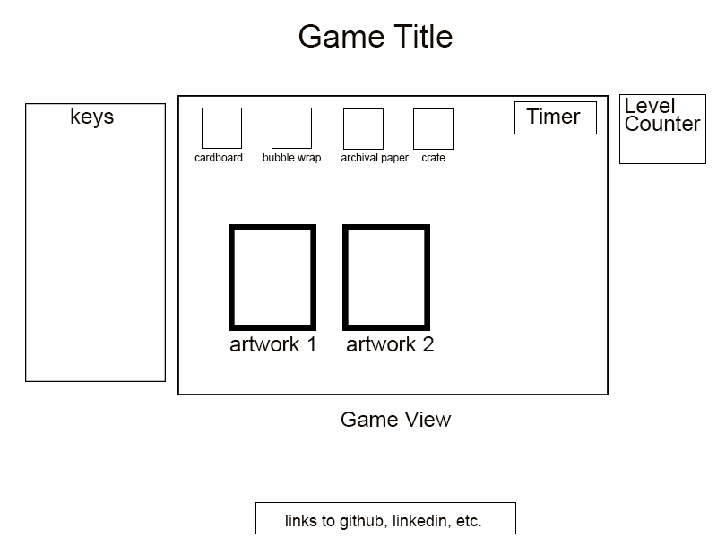

Art Wrap

Summary:

In Art Wrap, you are an art handler in a chaotic gallery who must pack artworks for last-minute exhibitions so they can be shipped out just in time.

Functionality & MVPs:

In this game, users will be able to:
- start and restart game
- use keyboard to select packaging materials to wrap each artwork
- move up to new levels
- see a counter that lists number of levels completed

Bonus
- after several levels, move on to new tier with new obstacles

This project will also include:
- a production README

Wireframe:

- Keys will include the three types of artwork (painting, framed drawing, sculpture), and the order of packaging materials that goes with each artwork type.
- Each packaging material corresponds to the four arrow keys. They must be selected in the order listed in the keys.

Technologies, Libraries:
-This project uses canvas API, HTML, CSS, Javascript, maybe 3js, webGL

Implementation Timeline:
- Friday Afternoon & Weekend: Set up webpack environment, sort out game logic, start to build up classes
- Monday: Focus on canvas and all CSS and html visuals
- Tuesday: Focus on visuals
- Wednesday: Bug-fixing, polishing text copy
- Thursday Morning: Deploy project to github

