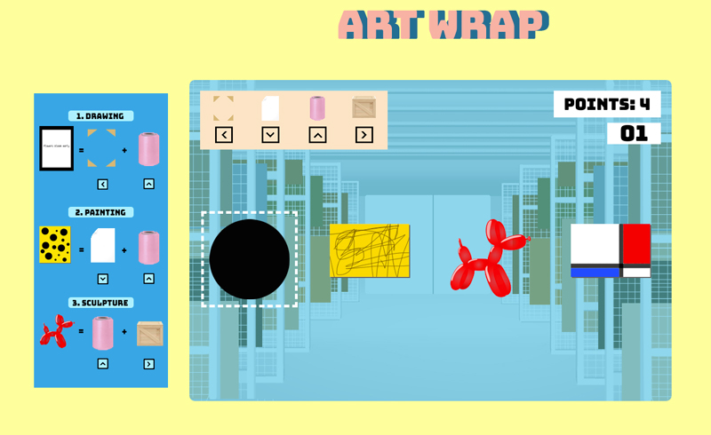

# Art Wrap

# Summary:

Art Wrap is a matching game where you play as an intern in a chaotic gallery and must wrap artworks with the right packaging for the next big show.

# Functionality & MVPs:

In this game, users will be able to:
- start and restart game
- use keyboard to select packaging materials to wrap each artwork
- move up to new levels
- see a timer countdown

## Bonus
- after several levels, move on to new stages
- implement a counter that shows number of levels (or artworks) completed

This project also includes:
- a production README

# Wireframe:

- Keys include the three types of artwork (painting, framed drawing, sculpture), and the order of packaging materials that goes with each artwork type.
- Each of the four arrow keys corresponds to a specific packaging material. They must be selected in the stated order.

# Technologies, Libraries:
-This project uses vanilla Javascript, CSS, and HTML

# Implementation Timeline:
- Friday Afternoon & Weekend: Set up webpack environment and display canvas on browser, work on game logic and pinning down the list of classes needed (currently: Game, Artwork, Material). Research and test out canvas and/or j3s framework code snippets. Set up basic functionality of game on screen.
- Monday: Continue with game logic coding, testing user control
- Tuesday: Continue with user control testing and moving games to second level. Start to work on views and styling 
- Wednesday: keep working on views, bug-fixing, and polishing text copy for README and anything else as necessary.
- Thursday Morning: Deploy project to github

