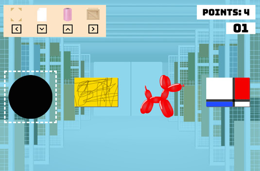

# Art Wrap | [LIVE](https://sonja-ng.github.io/art_wrap/)



Art Wrap is matching game where you play as a gallery intern who must wrap artworks with the correct materials before time runs out. The project uses 
Javascript, HTML5, and CSS3.

## Gameplay
- Keys include the three types of artwork (painting, framed drawing, sculpture), and the order of packaging materials that goes with each artwork type.
- Each of the four arrow keys corresponds to a specific packaging material. They must be selected in the stated order.

## Technologies
- Vanilla JavaScript DOM manipulation
- HTML5
- CSS3 / SCSS
- Webpack
- Babel

## Implementation
- The below code initializes the Game class by adding artworks to the artwork queue and rendering them onto the screen through pure JS DOM manipulation. The wrappers icons and scoreboards are also set up and made visible with CSS.
```js
//game.js
addArtwork(){
    for (let i = 0; i < LEVEL[this.level]; i++) {
      let art = new Artwork();
      this.artwork.push(art);
      this.artworkSrc.push(art.picture);
      this.firstWrappers.push(art.firstWrapper);
      this.secondWrappers.push(art.secondWrapper);
    }
  }


  draw(){
    const image = document.querySelector(".gallery");
    const ul = document.createElement("ul");

    for (let i = 0; i < this.artwork.length; i++) {
      const li = document.createElement("li");
      const img = document.createElement("img");
      img.src = this.artworkSrc[i];
      
      if (i === 0) {
        img.classList.add("current");
      } else {
        img.classList.add("artwork", "next");
      }

      li.append(img);
      ul.append(li);
    }

    image.append(ul);
    const icons = document.querySelector(".icons");
    icons.classList.remove("hidden");
    this.setUpScoreboard();
    this.fresh = false;
  }
```

## Features

In this game, users will be able to:
- start and restart game
- use keyboard to select packaging materials to wrap each artwork
- move up to new levels
- see a timer countdown

## Future Features
- Add new levels with different game plays and technologies