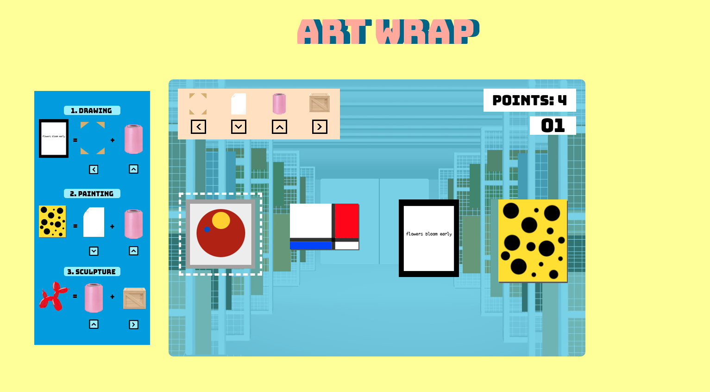

# Art Wrap | 



Art Wrap is matching game where you play as a gallery intern who must wrap artworks with the correct materials within a time limit. The project uses 
vanilla Javascript, CSS, and HTML5.

## Gameplay
- Keys include the three types of artwork (painting, framed drawing, sculpture), and the order of packaging materials that goes with each artwork type.
- Each of the four arrow keys corresponds to a specific packaging material. They must be selected in the stated order.

## Technologies
- Vanilla JavaScript DOM manipulation
- HTML5
- CSS3 / SASS
- Webpack
- Babel

## Implementation
- Check for Wrapper Match
```js
//game.js

   isCorrect() { 
    const currentArtwork = this.artwork[0];
    if (currentArtwork.status === -1) {
      if (this.currentKey === currentArtwork.keys[0]) {
        currentArtwork.updateStatus();
        return true;
      } else if (this.currentKey !== currentArtwork.keys[0] && this.wrapper.includes(this.currentKey)) {
         return false;
      }
    } else if (currentArtwork.status === 0) {
      if (this.currentKey === currentArtwork.keys[1]) {
        currentArtwork.updateStatus();
        return true;
      } else if (this.currentKey !== currentArtwork.keys[1] && this.wrapper.includes(this.currentKey)) {
         return false;
      }
    }
}
```

## Features

In this game, users will be able to:
- start and restart game
- use keyboard to select packaging materials to wrap each artwork
- move up to new levels
- see a timer countdown

## Future Features
- Add new levels with different game plays and technologies
- Add scoring system